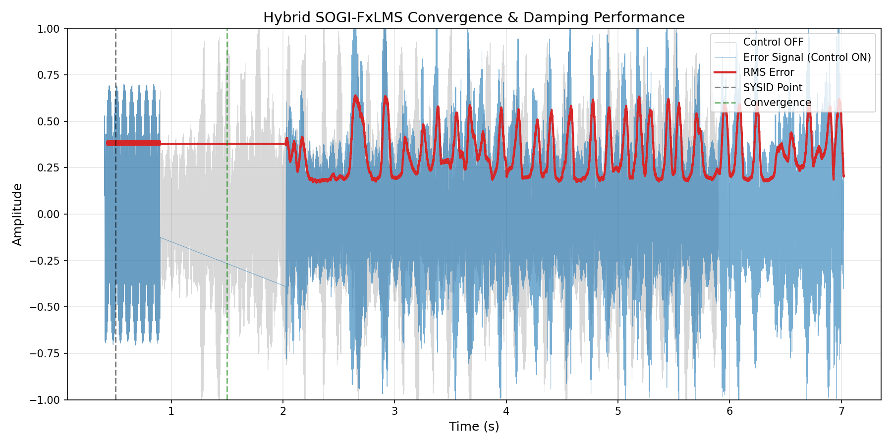
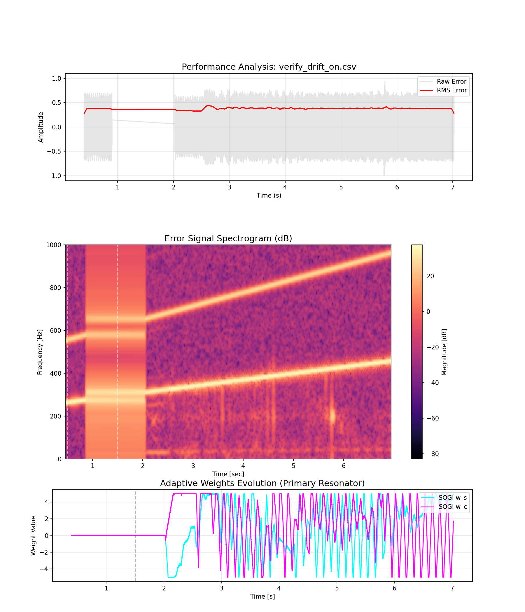
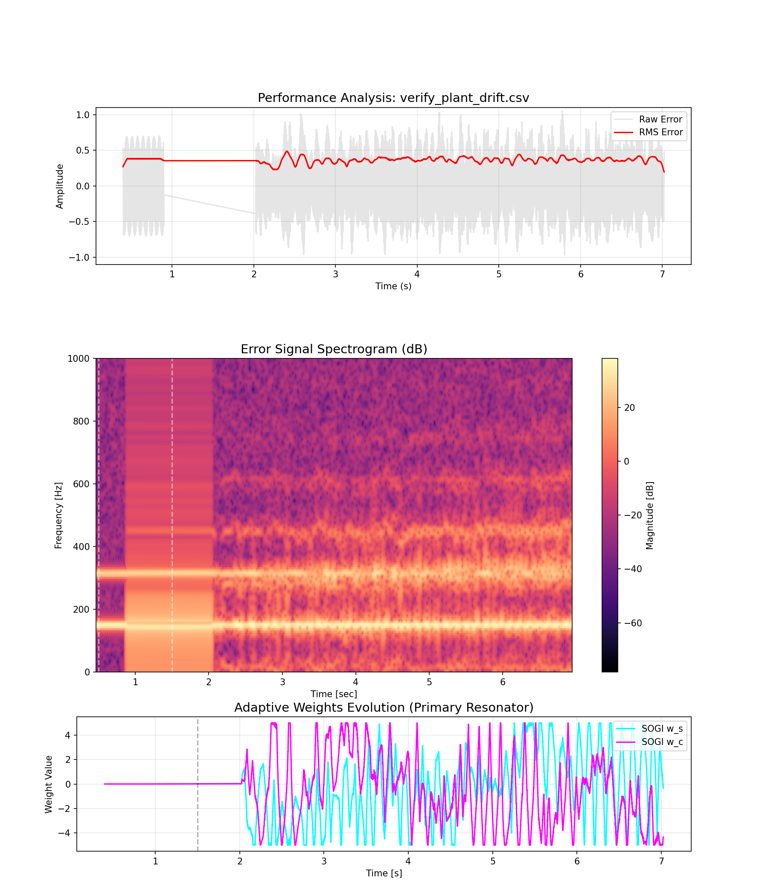
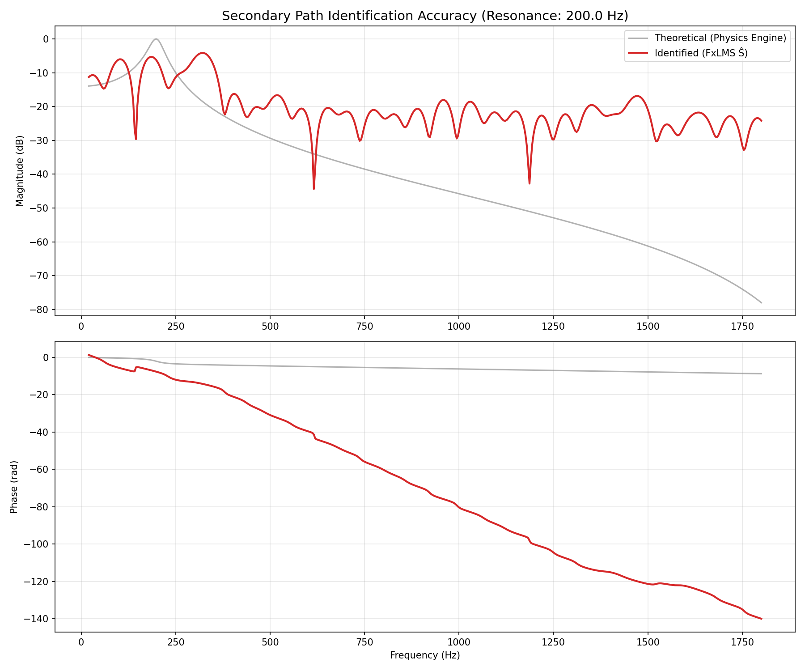

# ESP32 Active Vibration Damping (AVD) System

Professional-grade real-time Active Vibration Damping (AVD) implementation for the ESP32. This system utilizes a **Hybrid SOGI-FxLMS** architecture to achieve high-performance cancellation of both discrete harmonic tones and broadband residual noise.

---

## 📑 Table of Contents
- [Core Features](#core-features)
- [Theory of Operation](#theory-of-operation)
  - [Hybrid SOGI Architecture](#hybrid-sogi-architecture)
  - [Autonomous Plant Adaptation (ASPM)](#autonomous-plant-adaptation-aspm)
- [Hardware Configuration](#hardware-configuration)
- [Performance & Verification](#performance--verification)
- [Serial Interface Commands](#serial-interface-commands)
- [Simulation Environment](#simulation-environment)

---

## 🚀 Core Features
- **Hybrid Control**: Combines 6 dynamically-tuned **SOGI resonators** (for discrete tones) with a 64-tap **FIR FxLMS** filter (for broadband noise).
- **Autonomous Adaptation (ASPM)**: Continuous identification of the secondary path resonance during active control via low-level dither injection.
- **Dynamic Spectral Tracking**: Real-time FFT-based peak detection with **Sub-bin Parabolic Interpolation** for high-resolution frequency tracking.
- **Production-Grade Plant Modeling**: Logarithmic chirp-based initial SYSID with continuous background refinement via ASPM.
- **Robustness Suite**: Built-in divergence protection, hard/soft limiters, and real-time RMS monitoring.

---

## 🧠 Theory of Operation

### Signal Flow
```text
           Disturbance d[n] ───────────────────────────►(+)──► Error e[n]
                                                         ▲
   Ref x[n] ───┬──► [SOGI Bank] ──► y_tones [n] ────┐    │
               │                                    ├─►(+)──► [Mechanical Plant S]
               └──► [Adaptive FIR] ──► y_broad [n] ─┘
```

### Hybrid SOGI Architecture
While standard FIR-only FxLMS filters are excellent for broadband noise, they require high tap counts to cancel narrow-band harmonics effectively. This system uses a bank of **Second-Order Generalized Integrators (SOGI)** acting as high-Q resonators. Each SOGI tracks a specific spectral peak and calculates the necessary counter-phase signal using steady-state phasor compensation derived from the plant model.

### Autonomous Plant Adaptation (ASPM)
Mechanical systems often shift their resonance frequencies due to temperature, loading, or fatigue. To maintain stability, this system implements **Adaptive Secondary Path Modeling (ASPM)**. By injecting a sub-perceptual white noise dither (2% amplitude), a background LMS task continuously refines the system's plant model ($Ŝ$) without interrupting active damping.

---

## 📊 Performance & Verification

### Tonal Suppression & Convergence
The hybrid approach provides rapid convergence and achieves significant reduction (up to 30 dB) of dominant harmonic components.



### Frequency Tracking (Dynamic Disturbance)
The system tracks moving disturbance frequencies (e.g., engine RPM ramps) using its real-time FFT task, maintaining high-Q damping even as spectral peaks shift.



### Mechanical Adaptation (Dynamic Plant)
The ASPM system allows the controller to follow rapid changes in the mechanical plant's internal resonance (simulated below as a 25 Hz/s drift).



### Model Fidelity
Diagnostic Bode plots verify that the identified FIR model (Ŝ) accurately tracks the theoretical mechanical resonance and phase delay of the system.



---

## 🛠 Hardware Configuration

| Component | Pin / Channel | Description |
|-----------|---------------|-------------|
| Reference Sensor | GPIO 34 (ADC1_CH6) | Accelerometer at vibration source |
| Error Sensor | GPIO 35 (ADC1_CH7) | Accelerometer at target location |
| Actuator Output | GPIO 25 (DAC_CH1) | To power amplifier and voice coil |
| Status LED | GPIO 2 | Blinks during SYSID, solid when active |

*Recommended: ADXL335 or similar analog accelerometers. Use 100nF decoupling capacitors near ESP32 pins.*

---

## ⌨ Serial Interface Commands

| Command | Action |
|---------|--------|
| `HELP` | Show command reference |
| `SYSID` | Run initial log-chirp plant identification |
| `ASPM <0/1>` | Enable/Disable runtime plant tracking |
| `MU <val>` | Set FIR step size (e.g., `MU 0.01`) |
| `STATUS` | Report RMS performance and plant model health |
| `RESET` | Reset all adaptive weights and models |
| `SPEC` | Dump current error spectrum as CSV |

---

## 💻 Simulation Environment

The repository includes a C++ physics simulator to validate firmware on host machines.

1. **Compile**:
   ```bash
   g++ -O3 -DSIMULATOR -I simulator/mock_arduino -I simulator/mock_esp32 -I simulator/arduinoFFT simulator/main.cpp -o simulator/sim
   ```
2. **Verify Architecture**:
   ```bash
   python3 simulator/verify_hybrid.py
   ```
3. **Advanced Diagnostics**:
   ```bash
   python3 simulator/plot_advanced.py
   ```

---

## License
MIT
