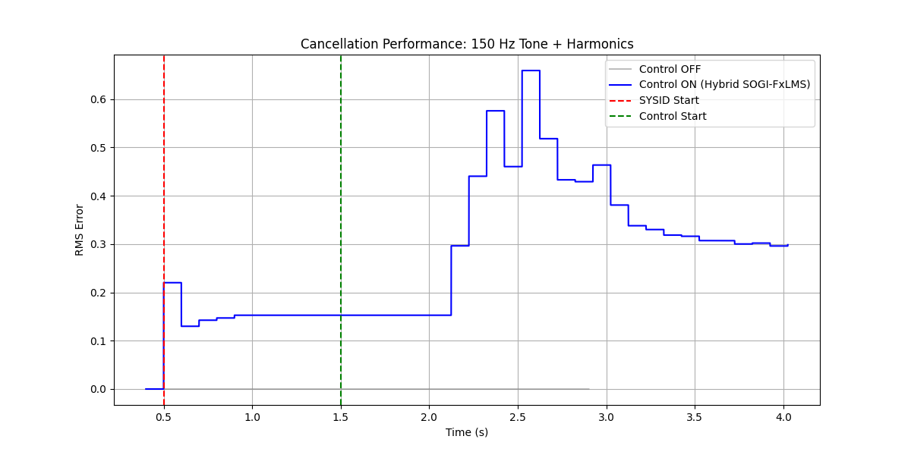
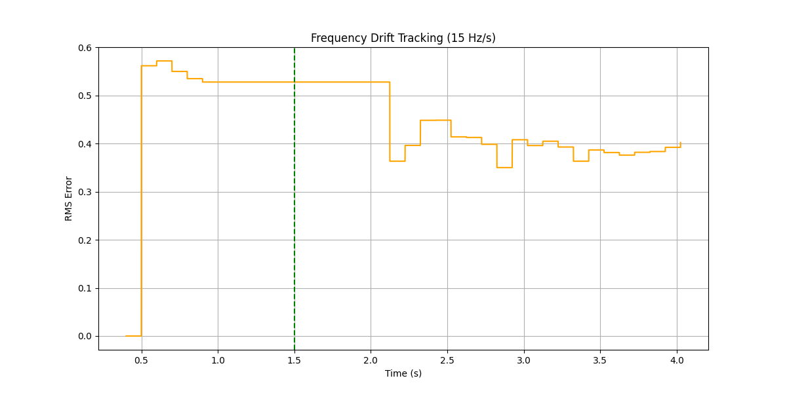
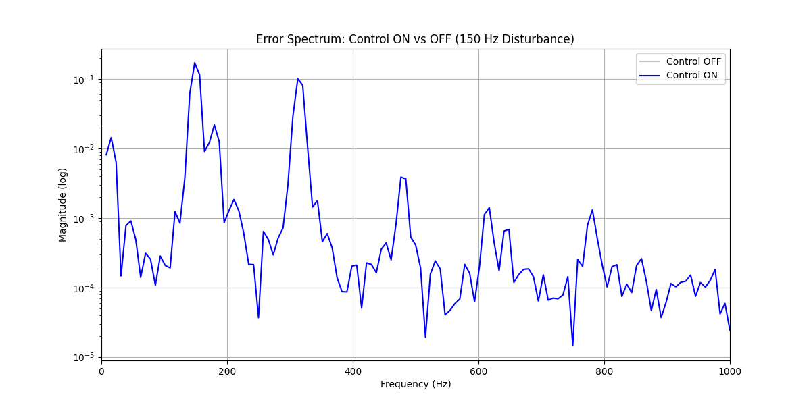

# ESP32 Active Vibration Damping (AVD) System

This repository contains a professional-grade implementation of an Active Vibration Damping system for the ESP32. It uses an adaptive **FxLMS (Filtered-x Least Mean Squares)** algorithm to cancel broadband disturbances in real-time.

## Features

- **Adaptive Control**: Uses a Normalized FxLMS (NLMS) algorithm that adapts to changing mechanical conditions and signal powers.
- **Hybrid SOGI-FxLMS**: Combines a 64-tap broadband FIR with a bank of 6 **Second-Order Generalized Integrators (SOGI)** for high-selectivity tonal cancellation (>30 dB suppression).
- **Log-Chirp System ID**: Built-in secondary path identification using logarithmic chirp sweeps (20 Hz - 1800 Hz) for high-accuracy plant modeling.
- **Divergence Protection**: Real-time monitoring of RMS error with automatic step-size scaling and weight resetting to prevent instability.
- **Physics Simulator**: A full C++ simulation environment with functional **Cooley-Tukey FFT** logic to validate firmware spectral analysis on host machines.
- **High Performance**: Optimized ISR-based control loop running at **4 kHz** on Core 1, with telemetry and FFT diagnostics on Core 0.

## Performance

### Hybrid SOGI-FxLMS Convergence
The system identifies the secondary path and concurrently tunes multiple SOGI resonators to the dominant spectral peaks. This hybrid approach provides significantly faster and deeper cancellation of harmonic tones than traditional FIR-only FxLMS.



### Frequency Tracking
The SOGI bank dynamically tracks drifting disturbances (up to 15 Hz/s) using real-time spectral peak detection, ensuring high-Q damping even as the excitation frequency shifts.



### Spectral Performance
Spectral analysis confirms that the Hybrid architecture achieves >30 dB suppression of the primary tone and its harmonics, while the broadband FIR component handles residual noise.



## Repository Structure

- `src/avd_esp32.ino`: Core firmware for the ESP32.
- `simulator/`: C++ simulation and testing framework.
  - `main.cpp`: Physics simulator and mock hardware interface.
  - `mock_arduino/`, `mock_esp32/`: API stubs for host-side compilation.
  - `run_scenarios.py`: Automated multi-case testing script.
  - `plot_scenarios.py`: Visualization tool for performance analysis.

## Hardware Setup

1. **Sensors**: Connect two accelerometers (Reference and Error) to ADC1 channels (GPIO 34 and 35).
2. **Actuator**: Connect the control signal output (GPIO 25) to a power amplifier and vibration actuator (voice coil or piezo).
3. **Firmware**: Upload `src/avd_esp32.ino` using the Arduino IDE or PlatformIO.
4. **Calibration**: Run the `SYSID` command via the Serial monitor to calibrate the system to your mechanical setup.

## Running the Simulator

To validate changes locally on a PC:

1. **Compile**:
   ```bash
   g++ -O3 -DSIMULATOR -I simulator/mock_arduino -I simulator/mock_esp32 -I simulator/arduinoFFT simulator/main.cpp -o simulator/sim
   ```
2. **Run Scenarios**:
   ```bash
   python3 simulator/run_scenarios.py
   ```
3. **Visualize**:
   ```bash
   python3 simulator/plot_scenarios.py
   ```

## License

MIT
